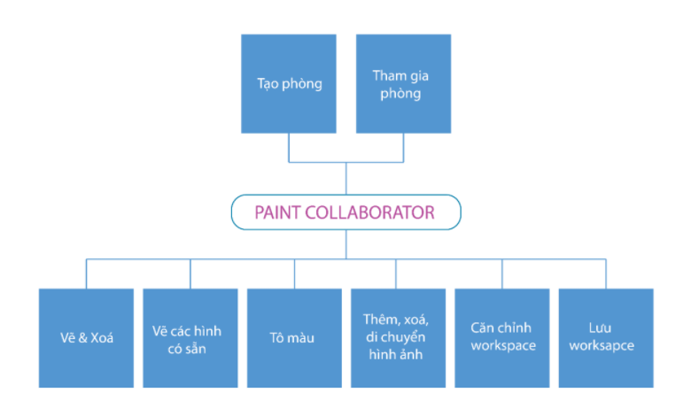
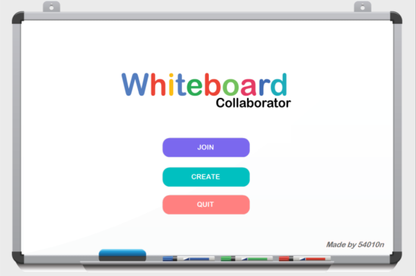
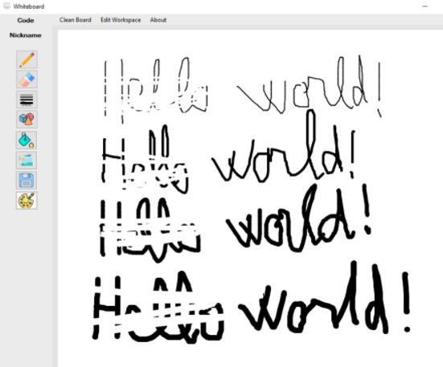
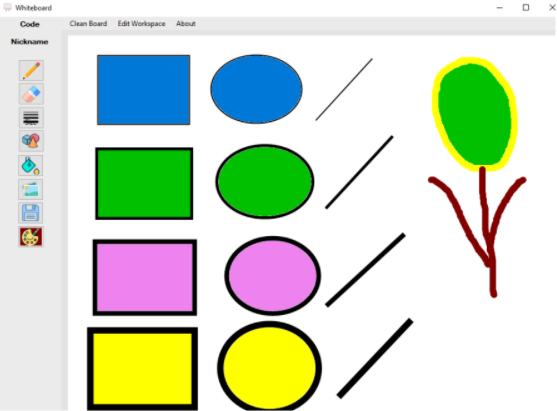
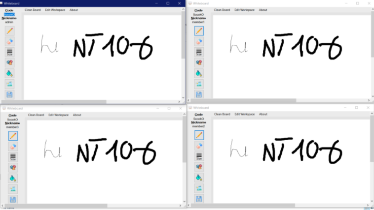
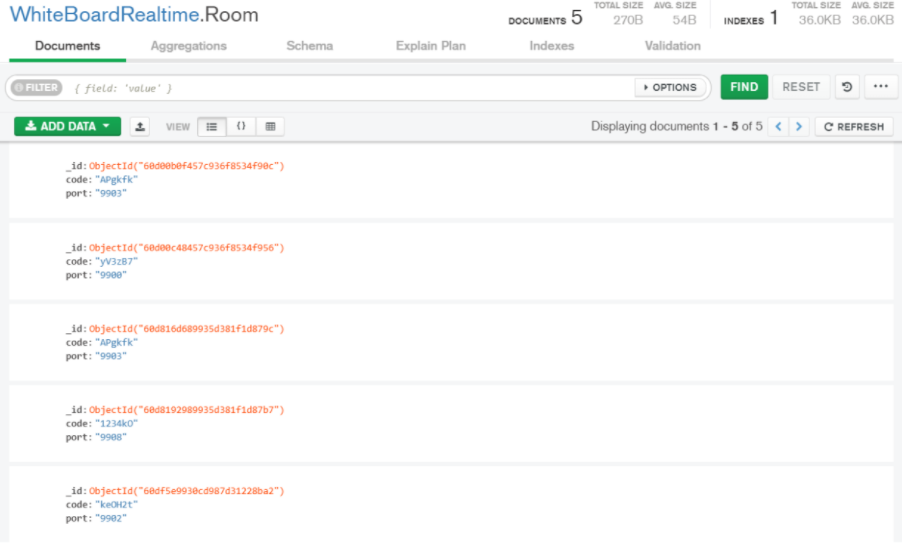

# Whiteboard Collaborator Using Socket

An C# application using socket to create an online Whiteboard room which had the idea look like Microsoft Paint and developed to multiple user who can paint on that room.

User can to generate a room and invites his friends to join in that room. Besides, other user could to go to a room by the room code (random generate by server for a room) which is sent by owner.

## Functions

This application has some functions such as:
- Paint: Draw random line
- Shape: Draw a shape (oval, rectangle, trianble,...)
- Color: Use color for the lines or paint; flood color on the shape; custom color;...
- Image: Add the image to workspace; manage the image with some basic function like move, delete,...
- Shortcut Keys: Some shortcut keys to optimize your work,...
- Workspace: Resize and Move the workspace (whiteboard),...

## Demo app
The application is coded by C# programming language. Its data are stored by MongoDB (database). To know more, i will describe the project below:
- The home interface:

- Join/Create the room:

- Workplace:

- Drawwing:

- Shape and color:

- Image handling: 

- Collaborator function:

- Database stored in MongoDB. It will be stored the room code, basic member info,...

## Note
This is the subject project!
